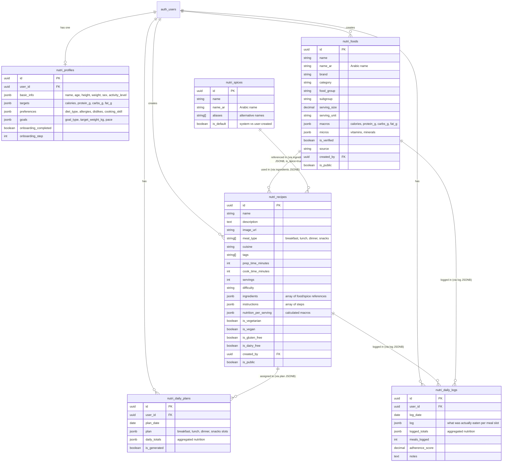

# BiteRight Database Schema

> **Last updated:** 2024-11-25
> 
> ⚠️ **Keep this document in sync with `supabase/schema.sql`**
> When you modify the database schema, update the ERD diagrams below.

## Terminology

| Term | Entity | Description |
|------|--------|-------------|
| **Food/Ingredient** | `nutri_foods` | Atomic items with nutrition data (chicken breast, rice, olive oil) |
| **Spice** | `nutri_spices` | Reference spices for recipes - do NOT count towards macros |
| **Recipe** | `nutri_recipes` | A dish made from multiple foods with instructions (Grilled Chicken Salad) |
| **Meal** | *Concept only* | A time slot in the day: `breakfast`, `lunch`, `dinner`, `snacks` - not a table |
| **Plan** | `nutri_daily_plans` | What you *should* eat - recipes assigned to meal slots for a day |
| **Log** | `nutri_daily_logs` | What you *actually* ate - foods/recipes logged to meal slots |
| **Profile** | `nutri_profiles` | User settings, nutritional targets, and preferences |

---

## Entity Relationship Diagram



---

## Data Flow Diagram

This shows how data flows through the system:

```mermaid
flowchart TB
    subgraph "Reference Data (shared)"
        F[🥕 nutri_foods<br/>Ingredients Database]
        R[🍽️ nutri_recipes<br/>Recipe Collection]
    end
    
    subgraph "User Data (per user)"
        P[👤 nutri_profiles<br/>User Settings & Targets]
        DP[📅 nutri_daily_plans<br/>Meal Plans]
        DL[✅ nutri_daily_logs<br/>Food Diary]
    end
    
    F -->|"ingredients[]"| R
    R -->|"plan.breakfast<br/>plan.lunch<br/>plan.dinner"| DP
    R -->|"log.*.items[]<br/>(from plan)"| DL
    F -->|"log.*.items[]<br/>(ad-hoc)"| DL
    P -->|"targets guide<br/>plan generation"| DP
    DP -.->|"compare for<br/>adherence_score"| DL

    style F fill:#e8f5e9
    style R fill:#e3f2fd
    style P fill:#fff3e0
    style DP fill:#fce4ec
    style DL fill:#f3e5f5
```



**Flow explanation:**
1. **Foods** are the building blocks (ingredients)
2. **Recipes** are composed from foods via the `ingredients` JSONB array
3. **Plans** schedule recipes into meal slots for specific dates
4. **Logs** track what was actually eaten (can be planned recipes OR ad-hoc foods)
5. **Profiles** provide the nutritional targets that guide plan generation

---

## JSONB Structure Reference

### nutri_profiles.basic_info
```json
{
  "name": "Sarah",
  "age": 32,
  "height_cm": 165,
  "weight_kg": 65,
  "sex": "female",
  "activity_level": "moderate"
}
```

### nutri_profiles.targets
```json
{
  "calories": 1800,
  "protein_g": 120,
  "carbs_g": 180,
  "fat_g": 60,
  "fiber_g": 25
}
```

### nutri_recipes.ingredients
```json
[
  {
    "food_id": "uuid-here",
    "raw_name": "chicken breast",
    "quantity": 200,
    "unit": "g",
    "is_spice": false,
    "is_optional": false
  },
  {
    "food_id": null,
    "raw_name": "cumin",
    "quantity": null,
    "unit": null,
    "is_spice": true,
    "is_optional": false
  }
]
```

> **Note on spices:** When `is_spice: true`, the ingredient references a spice from `nutri_spices`.
> - `food_id` is `null` (spices don't have macro data)
> - `quantity` and `unit` can be `null` (meaning "as desired")
> - Spices do NOT contribute to `nutrition_per_serving` calculations

### nutri_daily_plans.plan
```json
{
  "breakfast": { "recipe_id": "uuid", "servings": 1 },
  "lunch": { "recipe_id": "uuid", "servings": 1, "swapped": true },
  "dinner": { "recipe_id": "uuid", "servings": 1 },
  "snacks": [
    { "recipe_id": "uuid", "servings": 1 },
    { "food_id": "uuid", "amount": 1, "unit": "piece" }
  ]
}
```

### nutri_daily_logs.log
```json
{
  "breakfast": {
    "logged_at": "2024-11-25T08:30:00Z",
    "items": [
      { "type": "recipe", "recipe_id": "uuid", "servings": 1, "from_plan": true }
    ]
  }
}
```

---

## Updating This Document

When you modify the database schema:

1. **Update `supabase/schema.sql`** with your changes
2. **Update the ERD above** to reflect new tables/columns
3. **Update `lib/types/nutri.ts`** with corresponding TypeScript types
4. **Update the JSONB examples** if structure changed
5. **Update the date** at the top of this document

### Quick checklist for schema changes:
- [ ] `supabase/schema.sql` updated
- [ ] `docs/main/database-erd.md` updated (this file)
- [ ] `lib/types/nutri.ts` types updated
- [ ] `.github/copilot-instructions.md` updated if major changes
